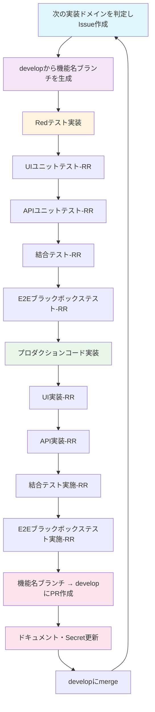

# Sirius (全自動開発フロー)
このプロジェクトでは、AIとGitHub Actionを用いたTDD開発フローを全自動化しています。

## 前提
### ドキュメント用意済
#### プロジェクト全体
- README.md
    - 概要: 開発者向けの案内
    - 項目: [プロジェクト概要, 環境構築手順, 開発手順]
- CLAUDE.md, AGENTS.md, GEMINI.md
    - 概要: AIコーディングエージェント向けの開発ガイド
    - 項目: [全自動開発フロー, 開発コマンド, ディレクトリ構成, 技術ガイド]
- docs/requirements.yml
    - 概要: プロジェクト全体の要件定義
    - 項目: [プロジェクト概要, 機能要件, 非機能要件]
- docs/domain.yml
    - 概要: ドメイン一覧
    - 項目: [カテゴリ分けされたドメイン一覧, ドメインの概要]
- docs/architecture.md
    - 概要: システムアーキテクチャ
    - 項目: [アーキテクチャ一覧, CI/CD]

#### ドメイン毎
- docs/domain/{domain-name}/requirements.yml
    - 概要: 一つ一つの機能の説明、非機能要件
    - 項目: [機能詳細一覧, 非機能要件]
- docs/domain/{domain-name}/usecase.md
    - 概要: 各ユースケースのフローチャート
    - 項目: [ユースケース一覧, ユースケース毎のフローチャート]
- docs/domain/{domain-name}/dataList.md
    - 概要: データ一覧とその保存場所
    - 項目: [データ一覧, ER図]
- docs/domain/{domain-name}/sequence.md
    - 概要: 各機能毎のシステムシーケンス
    - 項目: [各機能毎のシステムシーケンス]
- docs/domain/{domain-name}/componentList.yml
    - 概要: UI及びAPIの関数・コンポーネント一覧
    - 項目: [UIコンポーネント一覧, APIで使用する関数一覧]
- docs/domain/{domain-name}/testCase.yml
    - 概要: テストケース一覧
    - 項目: [UIテストケース一覧, APIテストケース一覧, 結合テスト一覧, E2Eブラックボックステスト一覧]
- docs/domain/{domain-name}/progress.md
    - 概要: 実装状況
    - 項目: [実装状況]

### プロジェクトテンプレート適用済
#### 技術スタック
- フレームワーク: Next.js
- DB・ストレージ: Convex
- 認証: Clerk
- テスト
    - フロント(React): Vitest + React Testing Library
    - API・結合: Vitest + convex-test + msw
    - E2E: Playwright
- AIエージェント: Mastra
- デプロイ: Vercel
#### 設定
これらの技術スタックを設定ファイル込でプロジェクトに配置し、環境変数をActionsのシークレットに設定済

### UIモック実装済
- 要件を達成するために必要なUIモックを全て作成済
    - TDD開発フローを開始した後、極力新しいUIを追加することが無いレベルまで作成されている
- API(Convex Function)はモック実装


## TDD開発フロー
### RR(レビューループ)
**全てのステップ** において、AIで実装した後に必ずAI自身でレビューさせる
1. 指定されたベースブランチから `{機能名}/{作業内容}` のブランチ名でブランチを作成
2. LLMで実装
3. PRを作成(ベースブランチに向ける)
4. Claude Code Actionでレビュー
5. 4で指摘が無くなるまでレビューループ
6. Gemini 2.5 Pro, OpenAI o3でレビュー
7. 6で指摘が無くなるまでレビューループ
8. ドキュメントを更新
9. (必要に応じて) GitHub ActionとVercelの環境変数を更新
10. PRマージ

### 全体概要


## 各ステップで使用するプロンプト
`{}` は実際の値に置換
### テスト実装
#### UI
##### 実装
```
@docs/domain/{domain-name} TDDで実装中です。UIユニットテスト(Red)を実装してください。 ultrathink, use context7(as needed)
- このドメインの全てのコンポーネントのテストを実装
- エラーケースも含め全て網羅する
- プロダクションコードの編集は禁止
```
##### レビュー
```
@docs/domain/{domain-name} UIユニットテスト(Red)を実装しました。これらの観点で厳格にレビューしてください。 ultrathink, use context7(as needed)
- このドメインの全てのコンポーネントのテストが実装されているか
- エラーケースも含め全て網羅されているか
- 不要なファイルが無いか
- プロダクションコードが編集されていないか
- テストの不足が無いか
```
#### API
##### 実装
```
@docs/domain/{domain-name} TDDで実装中です。APIユニットテスト(Red)を実装してください。 ultrathink, use context7(as needed)
- UIユニットテスト(Red)は実装済
- このドメインの全てのAPIのテストを実装
- エラーケースも含め全て網羅
- DBやストレージはconvex-testを用いてモック実装
- プロダクションコードの編集は禁止
```
##### レビュー
```
@docs/domain/{domain-name} APIユニットテスト(Red)を実装しました。これらの観点で厳格にレビューしてください。 ultrathink, use context7(as needed)
- このドメインの全てのAPIのテストが実装されているか
- エラーケースも含め全て網羅されているか
- 不要なファイルが無いか
- プロダクションコードが編集されていないか
- モックデータは適切か
- テストの不足が無いか
```
#### 結合テスト
##### 実装
```
@docs/domain/{domain-name} TDDで結合テスト(Red)を実装してください。 ultrathink, use context7(as needed)
- UIユニットテスト(Red)・APIユニットテスト(Red)は実装済
- このドメインの全てのユースケースを、エラーケースも含め全て網羅する
- DBやストレージはローカルConvexに値を用意して使用
    - https://docs.convex.dev/testing/convex-backend
- プロダクションコードの編集は禁止
```
##### レビュー
```
@docs/domain/{domain-name} 結合テスト(Red)を実装しました。これらの観点で厳格にレビューしてください。 ultrathink, use context7(as needed)
- このドメインの全てのユースケースを、エラーケースも含め全て網羅されているか
- 不要なファイルが無いか
- プロダクションコードが編集されていないか
- テストの不足が無いか
```
#### E2Eテスト
##### 実装
```
@docs/domain/{domain-name} TDDで実装中です。E2Eブラックボックステスト(Red)を実装してください。 ultrathink, use context7(as needed), use playwright(as needed)
- UIユニットテスト(Red)・APIユニットテスト(Red)・結合テスト(Red)は実装済
- このドメインをユーザーが使う時に想定される動作を、イレギュラーケースも含めてクリエイティブに発想しブラックボックステストを作成する
- DBやストレージはローカルConvexに値を用意して使用
    - https://docs.convex.dev/testing/convex-backend
- プロダクションコードの編集は禁止
```
##### レビュー
```
@docs/domain/{domain-name} 結合テスト(Red)を実装しました。これらの観点で厳格にレビューしてください。 ultrathink, use context7(as needed), use playwright(as needed)
- このドメインをユーザーが使う時に想定される動作を、イレギュラーケースも含めてクリエイティブに発想しブラックボックステストを作成されているか
- 不要なファイルが無いか
- テストの不足が無いか
- プロダクションコードが編集されていないか
```

### プロダクションコード実装
#### UI
##### 実装
```
@docs/domain/{domain-name} TDDで実装中です。UIを実装してください。 ultrathink, use context7(as needed)
- UIユニットテスト(Red)は実装済
- 実装後テストを実施し、全てのテストがGreenになるまでプロダクションコードを修正
- ハードコーディング禁止
- モック実装禁止
- テストコードの編集禁止
```
##### レビュー
```
@docs/domain/{domain-name} UIを実装しました。これらの観点で厳格にレビューしてください。 ultrathink, use context7(as needed)
- このドメインの全てのUIユニットテストがGreenになっているか
- 不要なファイルが無いか
- テストコードが編集されていないか
- ハードコーディングが無いか
- モック実装が無いか
- 他のプロダクションコード実装済のドメインのテストは全てGreenでパスしているか
```
#### API
##### 実装
```
@docs/domain/{domain-name} TDDで実装中です。APIを実装してください。 ultrathink, use context7(as needed)
- APIユニットテスト(Red)は実装済
- 実装後テストを実施し、全てのテストがGreenになるまでプロダクションコードを修正
- ハードコーディング禁止
- モック実装禁止
- テストコードの編集禁止
```
##### レビュー
```
@docs/domain/{domain-name} APIを実装しました。これらの観点で厳格にレビューしてください。 ultrathink, use context7(as needed)
- このドメインの全てのAPIユニットテストがGreenになっているか
- 不要なファイルが無いか
- テストコードが編集されていないか
- ハードコーディングが無いか
- モック実装が無いか
- 他のプロダクションコード実装済のドメインのテストは全てGreenでパスしているか
```
#### 結合テスト実施
##### 実行
```
@docs/domain/{domain-name} TDDで実装中です。結合テストを実施してください。 ultrathink, use context7(as needed)
- UI及びAPIは実装済
    - どちらもユニットテストは全てGreenでパス
- このドメインの全ての結合テストがGreenになるまでプロダクションコードを修正
- ハードコーディング禁止
- モック実装禁止
- テストコードの編集禁止
- Lint, Typecheckも解消する
```
##### レビュー
```
@docs/domain/{domain-name} 結合テストを全てGreenでパスしました。これらの観点で厳格にレビューしてください。 ultrathink, use context7(as needed)
- このドメインの全ての結合テストがGreenでパスしているか
- テストコードが編集されていないか
- ハードコーディングが無いか
- モック実装が無いか
- このドメインのLint, Typecheckが全て解消されているか
- 他のプロダクションコード実装済のドメインのテストは全てGreenでパスしているか
```
#### E2Eブラックボックステスト実施
##### 実行
```
@docs/domain/{domain-name} TDDで実装中です。E2Eブラックボックステストを実施してください。 ultrathink, use context7(as needed), use playwright(as needed)
- このドメインのUIユニットテスト・APIユニットテスト・結合テストは全てGreenでパス
- このドメインの全てのE2EテストがGreenになるまでプロダクションコードを修正
- ハードコーディング禁止
- モック実装禁止
- テストコードの編集禁止
- Lint, Typecheckも解消する
```
##### レビュー
```
@docs/domain/{domain-name} E2Eブラックボックステストを全てGreenでパスしました。これらの観点で厳格にレビューしてください。 ultrathink, use context7(as needed)
- このドメインの全ての結合テストがGreenでパスしているか
- テストコードが編集されていないか
- ハードコーディングが無いか
- モック実装が無いか
- このドメインのLint, Typecheckが全て解消されているか
- 他のプロダクションコード実装済のドメインのテストは全てGreenでパスしているか
```

### ドキュメント更新
```
@docs/domain/{domain-name} このドメインの実装が完了しました。developとの差分を確認し、ドキュメントを更新してください。また必要に応じてVercelとGitHubのSecretを更新してください。
```


# 実装ルール
- プロダクトコードはハードコーディングは禁止
    - テストコードはハードコーディング可
- デバッグしやすくするために、処理の中でログを徹底的に残すようにしてください
    - 一つ一つのログは単文で